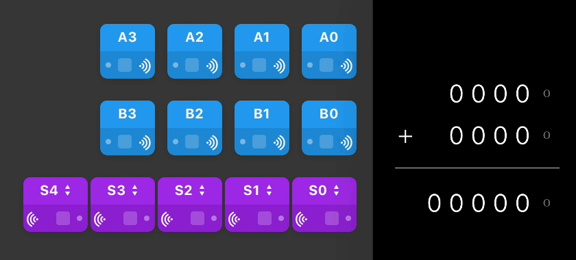
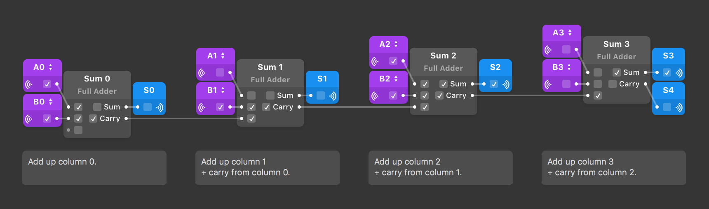

Binary Calculator
====

This Origami project models a 4-bit ripple-carry [adder](https://en.wikipedia.org/wiki/Adder_(electronics)). 

Includes Binary Calculator Kit, an Origami System with patches for building the adder: Exclusive Or, Half Adder, Full Adder, Binary to Decimal.

